# VideoAgent Architecture Overview

This document provides a comprehensive technical overview of VideoAgent - AI Video Production and Analysis, covering system architecture, data flows, processing pipelines, and deployment specifications for developers and platform architects.

## System Architecture

VideoAgent operates as a containerized MCP (Model Context Protocol) plugin within the Nexus ecosystem, leveraging distributed computing infrastructure for scalable video processing, AI analysis, and multi-platform distribution.

### High-Level Architecture

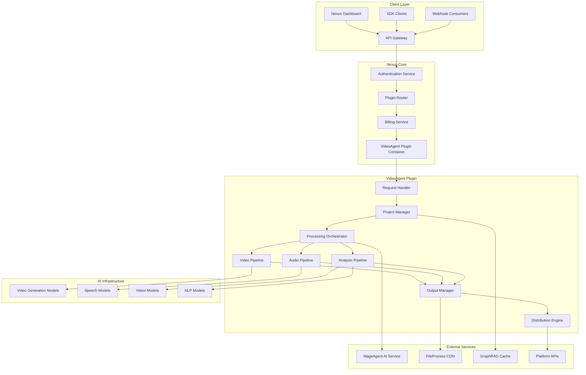

## Component Architecture

### Request Handler

The request handler manages incoming API calls, validates payloads, and routes requests to appropriate processing pipelines based on content type and requested operations.

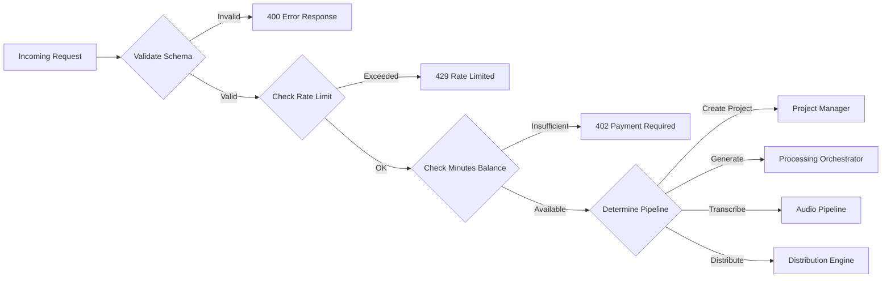

**Request Validation Pipeline:**

| Stage | Function | Timeout |
|-------|----------|---------|
| Schema Validation | JSON schema compliance | 100ms |
| Authentication | JWT/API key verification | 150ms |
| Rate Limiting | Token bucket algorithm | 30ms |
| Minutes Balance | Real-time quota query | 200ms |
| Resource Estimation | Processing cost calculation | 100ms |
| Job Creation | Queue insertion | 150ms |

### Project Manager

The Project Manager maintains state across multi-step video workflows, tracking source assets, intermediate outputs, and final deliverables.

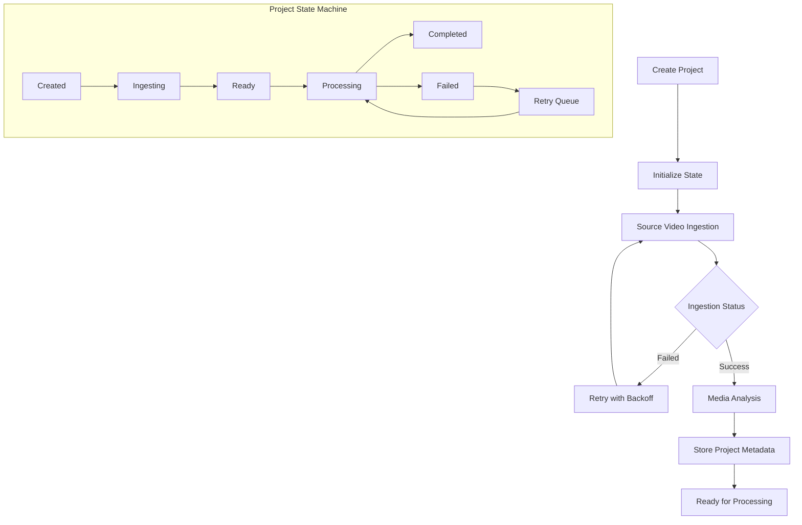

**Project Data Model:**

```yaml
project:
  id: string
  name: string
  status: enum[created, ingesting, ready, processing, completed, failed]
  createdAt: timestamp
  updatedAt: timestamp
  sourceVideos:
    - id: string
      url: string
      status: enum[pending, uploading, processing, ready, failed]
      metadata:
        duration: number
        resolution: string
        codec: string
        fileSize: number
  outputs: []
  processingJobs: []
  webhookConfig: object
  minutesUsed: number
```

### Processing Orchestrator

The Processing Orchestrator coordinates parallel and sequential processing tasks across multiple AI models and rendering engines.

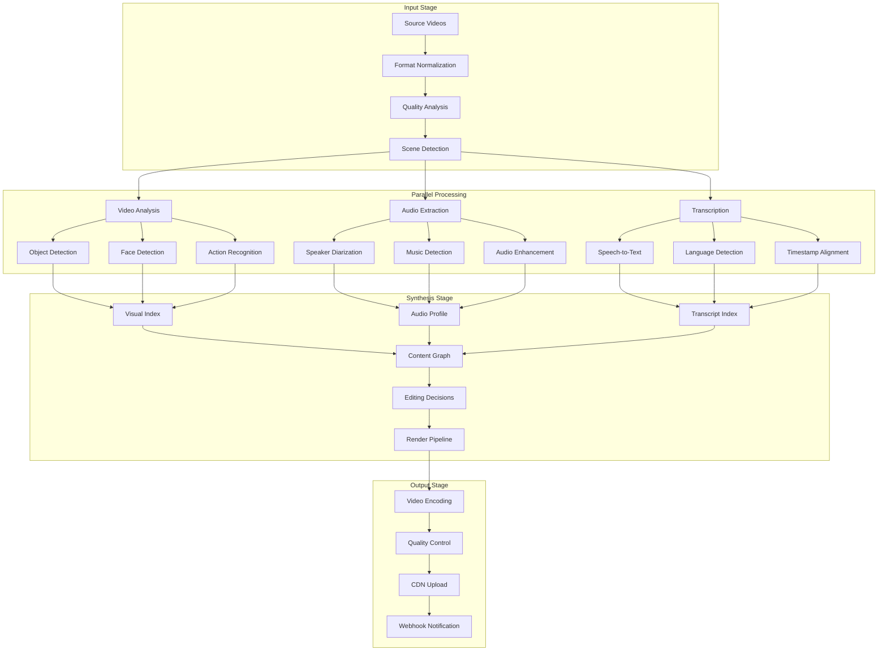

### Video Pipeline

The video pipeline handles all visual processing including analysis, editing, effects, and encoding.

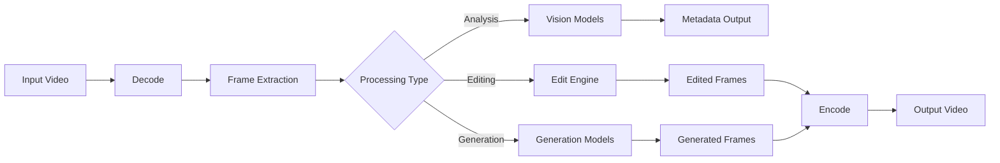

**Supported Processing Operations:**

| Operation | GPU Required | Typical Duration | Memory |
|-----------|--------------|------------------|--------|
| Scene Detection | Yes | 0.1x realtime | 2GB |
| Object Detection | Yes | 0.2x realtime | 4GB |
| Face Detection | Yes | 0.15x realtime | 3GB |
| Style Transfer | Yes | 2x realtime | 6GB |
| AI Editing | Yes | 1x realtime | 4GB |
| Encoding (H.264) | Optional | 0.5x realtime | 1GB |
| Encoding (H.265) | Optional | 1x realtime | 2GB |

### Audio Pipeline

The audio pipeline manages speech processing, transcription, translation, and audio enhancement.

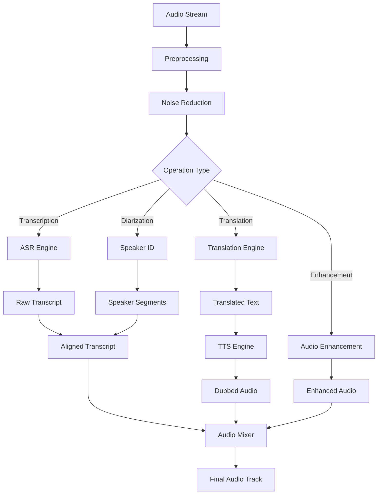

**Speech Model Specifications:**

| Model | Languages | Accuracy | Latency |
|-------|-----------|----------|---------|
| ASR-Standard | 50+ | 95% WER | 0.3x realtime |
| ASR-Premium | 100+ | 98% WER | 0.5x realtime |
| Diarization | Language-agnostic | 92% DER | 0.2x realtime |
| Translation | 30 pairs | BLEU 45+ | 0.1x realtime |
| TTS-Standard | 25 | MOS 4.0 | 0.05x realtime |
| TTS-Premium | 50 | MOS 4.5 | 0.1x realtime |

## Data Flow Architecture

### Video Processing Flow

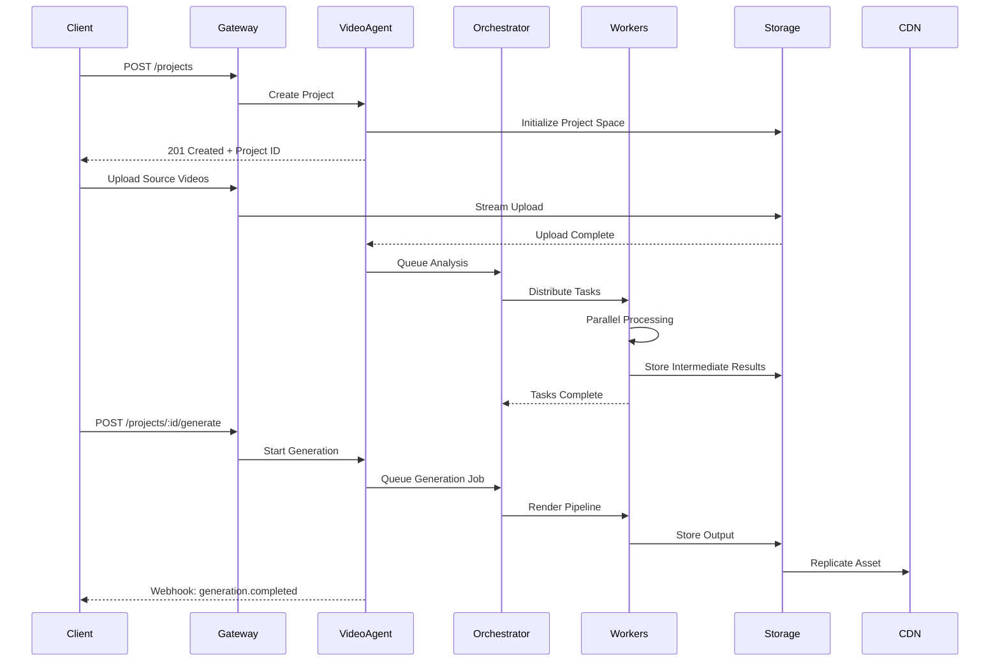

### Transcription Flow

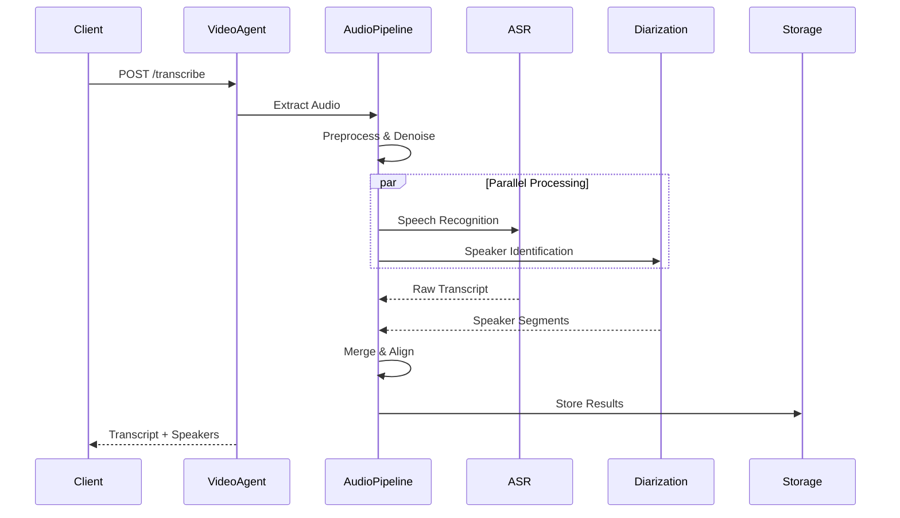

### Distribution Flow

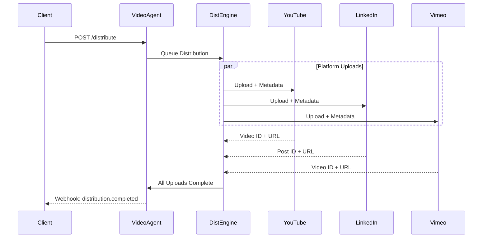

## Storage Architecture

### Tiered Storage System

Generated videos and intermediate assets flow through a tiered storage system optimized for different access patterns and retention requirements.

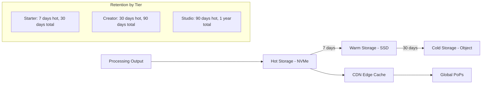

**Storage Specifications:**

| Tier | Type | Access Latency | Throughput | Cost |
|------|------|----------------|------------|------|
| Hot | NVMe SSD | <5ms | 10 Gbps | High |
| Warm | SSD | <50ms | 5 Gbps | Medium |
| Cold | Object Storage | <500ms | 1 Gbps | Low |
| Archive | Glacier-class | Minutes | 100 Mbps | Minimal |
| CDN Edge | In-memory | <10ms | 100 Gbps | Premium |

### Data Lifecycle Management

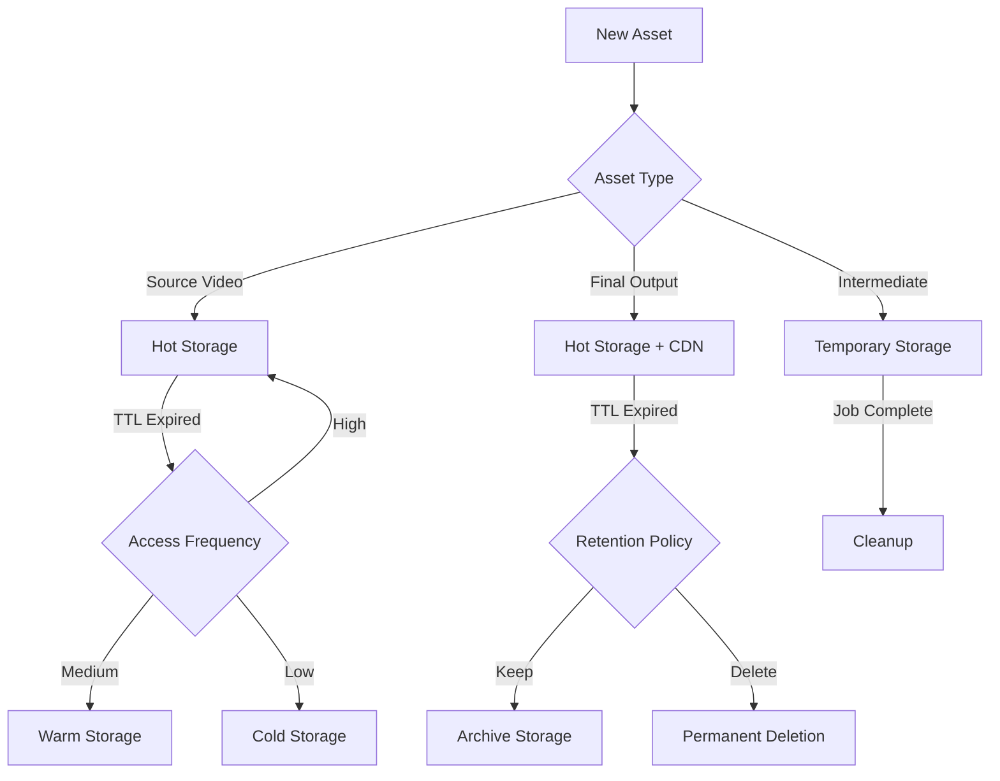

## Integration Architecture

### Nexus Core Services Integration

VideoAgent integrates with core Nexus services for AI processing, caching, file management, and billing.

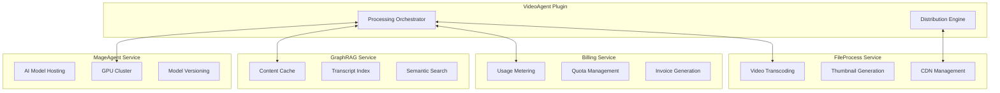

**Service Communication Protocols:**

| Service | Protocol | Port | Authentication | Timeout |
|---------|----------|------|----------------|---------|
| MageAgent | gRPC | 50051 | mTLS | 3600s |
| GraphRAG | REST | 8080 | Service Token | 30s |
| FileProcess | REST | 8081 | Service Token | 600s |
| Billing | gRPC | 50052 | mTLS | 5s |

### Platform Integrations

VideoAgent supports direct distribution to major video platforms through OAuth-secured connections.

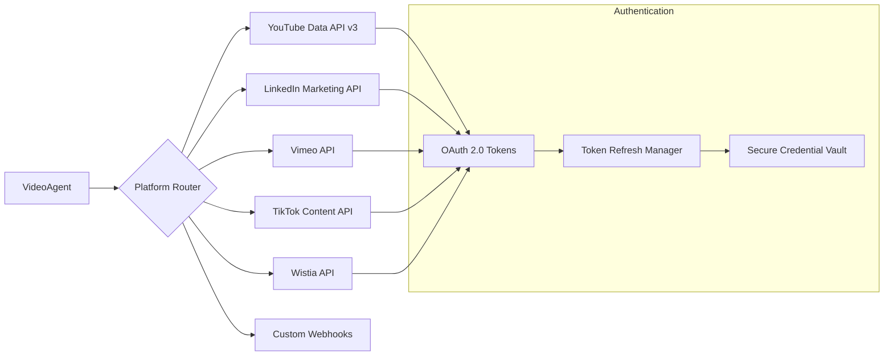

### Webhook Architecture

VideoAgent supports robust webhook delivery for asynchronous notification of processing events.

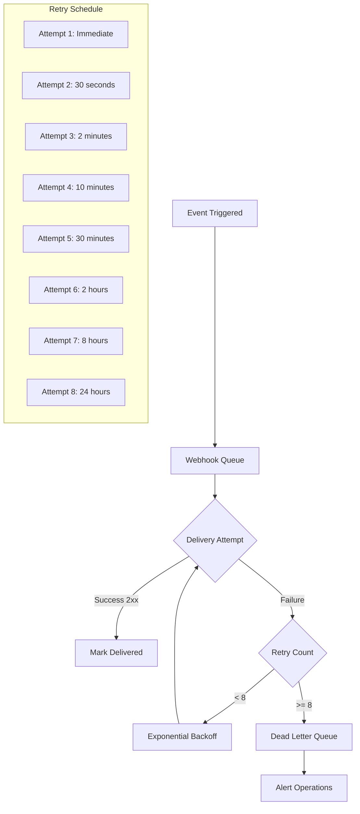

**Webhook Event Types:**

| Event | Trigger | Payload Size |
|-------|---------|--------------|
| `project.created` | Project initialized | ~1 KB |
| `project.ready` | Source videos processed | ~2 KB |
| `generation.started` | Processing begins | ~1 KB |
| `generation.progress` | Every 10% progress | ~500 B |
| `generation.completed` | Output ready | ~5 KB |
| `generation.failed` | Processing error | ~2 KB |
| `transcription.completed` | Transcript ready | ~10 KB |
| `distribution.completed` | All platforms done | ~3 KB |

**Webhook Payload Example:**

```json
{
  "event": "generation.completed",
  "timestamp": "2025-01-15T14:32:18.547Z",
  "data": {
    "projectId": "proj_9a8b7c6d5e4f3a2b",
    "generationId": "gen_7f6e5d4c3b2a1098",
    "status": "completed",
    "outputs": [
      {
        "id": "out_abc123def",
        "type": "final-video",
        "url": "https://cdn.adverant.ai/videoagent/proj_9a8b7c6d5e4f3a2b/final_1080p.mp4",
        "duration": 87,
        "resolution": "1920x1080"
      }
    ],
    "minutesUsed": 8.5,
    "processingTimeSeconds": 423
  },
  "signature": "sha256=7f8a9b2c3d4e5f6a7b8c9d0e1f2a3b4c5d6e7f8a9b0c"
}
```

## Deployment Architecture

### Kubernetes Deployment

VideoAgent deploys as a containerized workload with horizontal pod autoscaling based on queue depth and processing load.

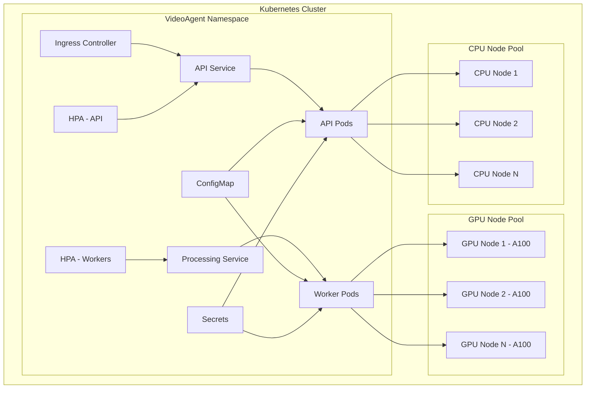

**Resource Specifications:**

```yaml
apiPods:
  resources:
    requests:
      cpu: "1000m"
      memory: "2048Mi"
    limits:
      cpu: "2000m"
      memory: "4096Mi"
  autoscaling:
    minReplicas: 2
    maxReplicas: 10
    targetCPUUtilization: 70

workerPods:
  resources:
    requests:
      cpu: "4000m"
      memory: "8192Mi"
      nvidia.com/gpu: 1
    limits:
      cpu: "8000m"
      memory: "16384Mi"
      nvidia.com/gpu: 1
  autoscaling:
    minReplicas: 2
    maxReplicas: 50
    customMetrics:
      - type: queue-depth
        target: 5
```

### High Availability Configuration

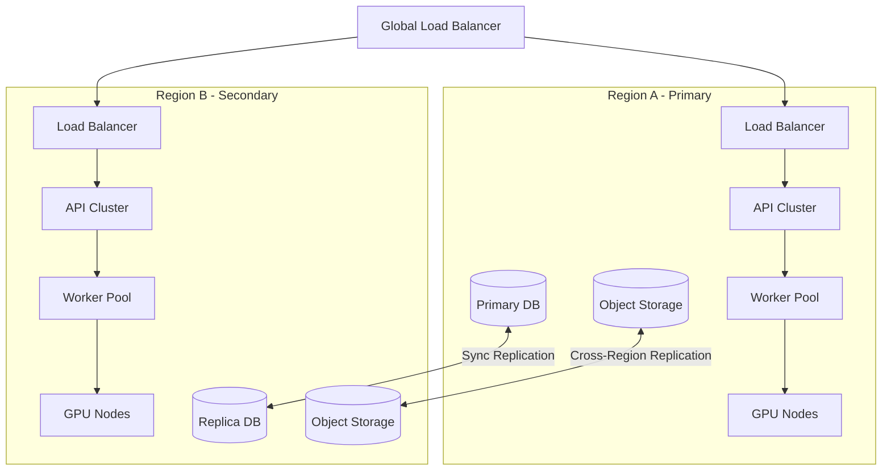

## Security Architecture

### Data Protection

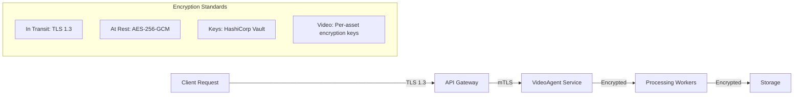

**Security Controls:**

| Layer | Control | Implementation |
|-------|---------|----------------|
| Network | Encryption | TLS 1.3 mandatory |
| Authentication | API Keys | SHA-256 hashed, rotatable |
| Authorization | RBAC | Workspace-scoped permissions |
| Data | Encryption | AES-256-GCM at rest |
| Video Assets | Encryption | Per-asset derived keys |
| Platform Tokens | Storage | Encrypted vault storage |
| Audit | Logging | Immutable audit trail |
| Compliance | Standards | SOC 2 Type II, GDPR |

### Content Safety Pipeline

All processed content passes through multi-stage safety filtering.

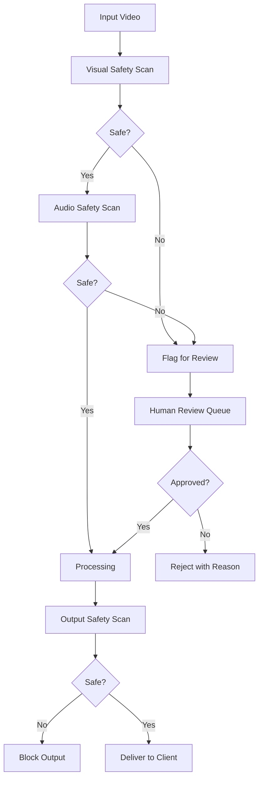

## Performance Specifications

### Processing Latency Targets

| Operation | P50 | P95 | P99 |
|-----------|-----|-----|-----|
| API Response | 200ms | 500ms | 1s |
| Project Creation | 500ms | 1s | 2s |
| Video Analysis (per minute) | 30s | 45s | 60s |
| Transcription (per minute) | 20s | 30s | 45s |
| Video Generation (per minute) | 60s | 90s | 120s |
| Distribution (per platform) | 60s | 180s | 300s |
| Webhook Delivery | 500ms | 2s | 5s |

### Throughput Capacity

| Tier | Concurrent Projects | Processing Jobs/Hour | Storage |
|------|---------------------|----------------------|---------|
| Starter | 2 | 10 | 10 GB |
| Creator | 5 | 50 | 100 GB |
| Studio | 20 | Unlimited | 1 TB |

### Resource Utilization Limits

| Resource | Starter | Creator | Studio |
|----------|---------|---------|--------|
| Max Video Duration | 30 min | 2 hours | 8 hours |
| Max File Size | 2 GB | 10 GB | 50 GB |
| Max Resolution | 1080p | 4K | 8K |
| Concurrent Uploads | 1 | 5 | 20 |
| API Rate Limit | 60/min | 300/min | 1000/min |

## Monitoring and Observability

### Metrics Collection

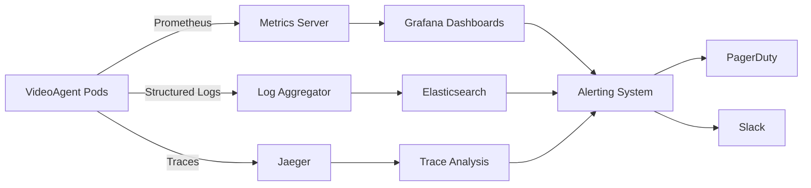

**Key Metrics Monitored:**

- Processing queue depth and wait times
- GPU utilization and memory pressure
- Transcription accuracy scores
- Distribution success rates
- API latency percentiles
- Minutes consumption rates
- Error rates by operation type
- Storage utilization trends

## API Specifications Summary

| Endpoint | Method | Timeout | Rate Limit |
|----------|--------|---------|------------|
| `/api/v1/video/projects` | POST | 30s | 30/min |
| `/api/v1/video/projects/:id/generate` | POST | 3600s | 10/min |
| `/api/v1/video/transcribe` | POST | 3600s | 20/min |
| `/api/v1/video/distribute` | POST | 600s | 10/min |
| `/api/v1/video/projects/:id` | GET | 30s | 120/min |

For complete API documentation, see [API Reference](docs/api-reference/endpoints.md).

## Further Reading

- [Quick Start Guide](QUICKSTART.md) - Get up and running quickly
- [Use Cases](USE-CASES.md) - Real-world implementation patterns
- [API Reference](docs/api-reference/endpoints.md) - Complete endpoint documentation
- [Platform Integration Guide](docs/guides/platform-setup.md) - Connect distribution platforms
- [Security Whitepaper](docs/security/overview.md) - Detailed security architecture
